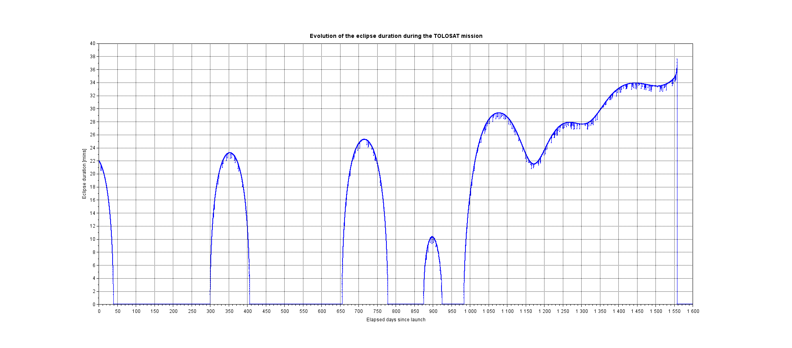

# Long Term Eclipses
This script uses the STELA propagator to compute mean keplerian elements through the entire mission duration (until re-entry) and for each orbit a basic keplerian propagation will be computed to estimate the eclipse duration.

