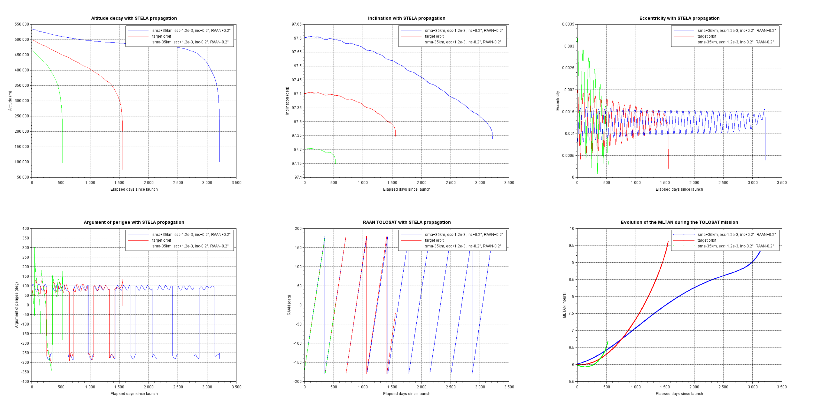

# Orbit Insertion Errors

This script uses the STELA propagator to compute the effect of various orbit insertion errors on the entire mission (until re-entry). For each orbit a basic keplerian propagation is performed to estimate the eclipse duration.

